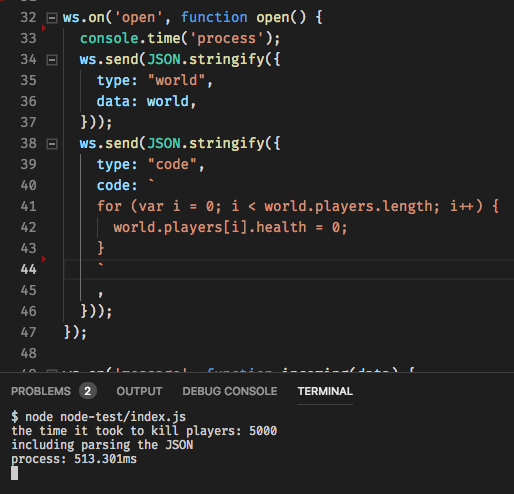

# JavaScript Sandbox on the Server

Q: Can a user provided game logic run on the server (in a sandbox) and be responsive?

A: The JavaScript sandbox on the server are pretty fast. The amount of data and the format (like JSON) is the bottleneck in this approach.



## Flow (draft)
1. client connects and keeps connection alive with a ping/pong, this uses ressources but we know the connection is alive, which decrases our response time.
1. client sends world state
1. client can send world state as many time he wants it updates on the server, in memory
1. client sends code, javascript
1. server responds with status if ok or error
1. server sends world state
1. disconnect
1. repeat with 1

## Data format
The data is for now string encoded JSON.

```js
// Response
{
  type: "response",
  status: "ok" || "error",
  message: "error text",
}

// sending world
{
  type: "world",
  data: {
    health: 100,
    weapons: 30,
    enemy: {
      name: "slime",
      health: 100,
    }
  }
}

// sending code
{
  type: "code",
  code: "if ('dfdf')",
}

```

## Questions
* Does the client need to provide a session, session id. Or can it be omitted ebcause we do not close the connection.
* Is websocket ping/pong native, or do clients have to implement it?
* Do we need to respond websocket request with a custom payload, or is success response built in?

## Future/Later/TODO
* Server and client could only send diff of the world state, but then both should be able to request full state if they lose it.
* JSON can be replaced with a faster format, binary or MessagePack
* Instead of using otto, it could use v8 sandboxed.

## Frontend
* microsoft monaco with javascript
* find out a way how to blacklist things
* preview of the data as hightlighted json, when diff comes back it should be animated

## Material and Notes
* [Handling raw JSON](https://stackoverflow.com/a/20105590/279890)
